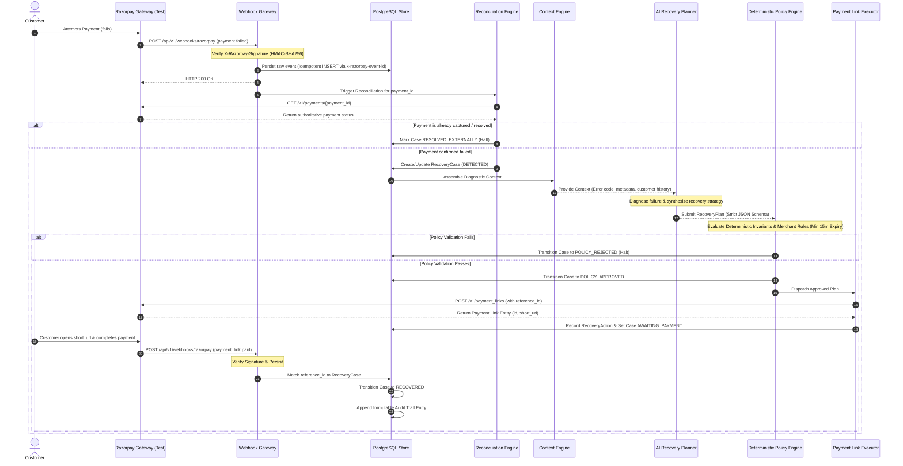

# System Architecture — Project Phoenix

## 1. High-Level Architecture Overview

Project Phoenix is designed as a modular, asynchronous, policy-governed revenue recovery orchestration platform. The system operates on a clean separation of concerns where **stochastic AI planning is decoupled from deterministic financial execution**.

```
                           ┌─────────────────────────────────────────────────────────┐
                           │                   RAZORPAY GATEWAY                      │
                           │                      (Test Mode)                        │
                           └───────────────▲─────────────────────────┬───────────────┘
                                           │                         │
                                    Payment Links             Webhook Events
                              (POST /v1/payment_links)   (payment.failed, payment_link.paid)
                                           │                         │
                                           │                         ▼
┌──────────────────────────────────────────┼─────────────────────────────────────────────────────────┐
│ PHOENIX BACKEND (FastAPI / Python)       │                                                         │
│                                          │             ┌─────────────────────────┐                 │
│                                          │             │ 1. Webhook Gateway      │                 │
│                                          │             │   - Signature Validator │                 │
│                                          │             └───────────┬─────────────┘                 │
│                                          │                         │                               │
│                                          │                         ▼                               │
│                                          │             ┌─────────────────────────┐                 │
│                                          │             │ 2. Ingestion & Event    │                 │
│                                          │             │    Idempotency Store    │                 │
│                                          │             └───────────┬─────────────┘                 │
│                                          │                         │                               │
│                                          │                         ▼                               │
│                                          │             ┌─────────────────────────┐                 │
│                                          │             │ 3. State Reconciliation │                 │
│                                          │             │    (GET /v1/payments)   │                 │
│                                          │             └───────────┬─────────────┘                 │
│                                          │                         │                               │
│                                          │                         ▼                               │
│                                          │             ┌─────────────────────────┐                 │
│                                          │             │ 4. Context Engine       │                 │
│                                          │             │    (Extract features)   │                 │
│                                          │             └───────────┬─────────────┘                 │
│                                          │                         │                               │
│                                          │                         ▼                               │
│  ┌─────────────────────────┐             │             ┌─────────────────────────┐                 │
│  │ 7. Razorpay Executor    │             │             │ 5. AI Recovery Planner  │                 │
│  │   - Deterministic API   │◄──────────────────────────┤   - Structured JSON Out │                 │
│  │   - Idempotency Key Gen │             │             │   - Diagnostic Reasoner │                 │
│  └───────────┬─────────────┘             │             └───────────┬─────────────┘                 │
│              │                           │                         │                               │
│              │                           │                         ▼                               │
│              │                           │             ┌─────────────────────────┐                 │
│              │                           │             │ 6. Deterministic Policy │                 │
│              │                           │             │    Engine (Fail-Closed) │                 │
│              │                           │             └─────────────────────────┘                 │
│              │                                                                                     │
│              ▼                                                                                     │
│  ┌─────────────────────────┐                           ┌─────────────────────────┐                 │
│  │ 8. State Machine &      │                           │ 9. Audit Trail & Log    │                 │
│  │    Case Lifecycle Mgr   ├──────────────────────────►│    Store (Immutable)    │                 │
│  └─────────────────────────┘                           └─────────────────────────┘                 │
│                                                                                                    │
└──────────────────────────────────────────┬─────────────────────────────────────────────────────────┘
                                           │
                                    REST API Queries
                                           │
                                           ▼
┌────────────────────────────────────────────────────────────────────────────────────────────────────┐
│ PHOENIX FRONTEND (Next.js / TypeScript / shadcn/ui)                                               │
│                                                                                                    │
│  ┌───────────────────────────────┐  ┌───────────────────────────────┐  ┌─────────────────────────┐ │
│  │ Recovery Pipeline Dashboard   │  │ Case Details & Reasoner View  │  │ HITL Action / Overrides │ │
│  └───────────────────────────────┘  └───────────────────────────────┘  └─────────────────────────┘ │
└────────────────────────────────────────────────────────────────────────────────────────────────────┘
```

---

## 2. Core Subsystems & Components

### 2.1 Webhook Gateway
- **Function:** Ingests raw HTTP POST webhooks from Razorpay.
- **Security Check:** Computes HMAC-SHA256 of raw request body using `RAZORPAY_WEBHOOK_SECRET` and compares in constant time against header `X-Razorpay-Signature`.
- **Response SLA:** Responds immediately with HTTP 200 OK after signature verification and persistence to prevent gateway timeouts/retries.

### 2.2 Event Ingestion & Idempotency Store
- **Function:** Guarantees exact-once processing semantics.
- **Mechanism:** Stores the raw payload in `raw_webhook_events`. Enforces a unique constraint on the official `x-razorpay-event-id` header (stored as `event_id`).
- **Deduplication:** If a duplicate event arrives (e.g., webhook retry), it is logged and immediately acknowledged with HTTP 200 without re-triggering the orchestration pipeline.

### 2.3 State Reconciliation Engine
- **Function:** Eliminates race conditions and false failure assumptions.
- **Mechanism:** When a `payment.failed` event is received, Phoenix queries `GET /v1/payments/{payment_id}` or checks linked order state before taking action.
- **Protection:** Protects against scenarios where a user retried immediately on checkout and succeeded, or where webhooks arrived out of order.

### 2.4 Context Engine
- **Function:** Assembles a comprehensive diagnostic payload for the AI planner.
- **Context Gathered:**
  - Payment entity details: `amount`, `currency`, `method` (card, upi, netbanking), `bank`, `wallet`, `vpa`.
  - Error entity details: `error_code`, `error_description`, `error_source`, `error_step`, `error_reason`.
  - Customer context: historical failure count, past recoveries, lifetime value tier.
  - Merchant rules: allowable recovery channels, max allowable discounts, maximum retry attempts.

### 2.5 AI Recovery Planner (Advisory Layer)
- **Function:** Diagnoses the root cause of failure and formulates an optimal recovery strategy.
- **Design:** Provider-independent client wrapping structured outputs (OpenAI Functions/Structured Outputs, Gemini Function Calling, or Anthropic Tool Calling).
- **Output:** Validated against a strict Pydantic model (`RecoveryPlan`).
- **Constraint:** Zero access to environment variables, credentials, or network tools. Pure cognitive input $\to$ structured output.

### 2.6 Deterministic Policy Engine (Guardrail Layer)
- **Function:** Validates the AI's proposed `RecoveryPlan` against merchant-defined invariants.
- **Enforcement Rules:**
  - Maximum retry attempts per customer/order.
  - Mandatory minimum cooldown intervals between communications.
  - Expiry constraints on generated payment links (strictly minimum 15 mins, maximum 72 hours).
  - Discount/incentive caps (e.g., cannot offer incentives exceeding merchant threshold).
- **Safety Mode:** **Fails closed**. If validation fails or the AI output is malformed, the plan is rejected, the case is marked `POLICY_VIOLATION` or `ESCALATED`, and no financial API is called.

### 2.7 Payment Link Execution Engine
- **Function:** Deterministic worker that takes an approved `RecoveryPlan` and calls Razorpay REST API.
- **Action:** Generates a targeted Razorpay Payment Link (`POST /v1/payment_links`) with metadata binding it to the `recovery_case_id`.
- **Idempotency:** Generates and passes a unique `reference_id` to Razorpay to prevent duplicate link generation.

### 2.8 State Machine & Case Lifecycle Manager
- **Function:** Governs the lifecycle transitions of a `RecoveryCase`.
- **States:** `DETECTED` $\to$ `DIAGNOSING` $\to$ `PLAN_GENERATED` $\to$ `POLICY_APPROVED` $\to$ `EXECUTING` $\to$ `AWAITING_PAYMENT` $\to$ `RECOVERED` (or terminal failure states: `EXPIRED`, `CANCELLED`, `POLICY_REJECTED`, `FAILED`).
- **Invariants:** Disallows illegal transitions (e.g., cannot transition from `RECOVERED` to `FAILED`).

### 2.9 Immutable Audit Engine
- **Function:** Records an immutable ledger entry for every state transition, policy check, LLM request/response, and gateway API call.
- **Storage:** Appended to PostgreSQL table `audit_logs`.

---

## 3. End-to-End Golden Path Sequence



---

## 4. Security & Credential Isolation Architecture

1. **Zero Credential Exposure to LLM:**
   - LLM prompts are sanitized. PII (phone numbers, emails) is tokenized/masked where appropriate.
   - API secrets (`RAZORPAY_KEY_SECRET`, `RAZORPAY_WEBHOOK_SECRET`) never enter LLM prompt contexts.
2. **Environment Variable Segregation:**
   - `RAZORPAY_KEY_ID` and `RAZORPAY_KEY_SECRET` are read only by backend modules `razorpay_client.py`.
   - Frontend Next.js app communicates only with Phoenix internal APIs, never with Razorpay directly.
3. **Fail-Closed Networking:**
   - External calls from the backend are strictly limited to Razorpay REST endpoints (`https://api.razorpay.com/v1/...`) and the configured AI Provider endpoint.

---

## 5. Two-Tier Idempotency & Concurrency Strategy

> [!IMPORTANT]
> **The Idempotency Formula:**  
> $$\text{Phoenix Application DB State Lock} + \text{Razorpay Unique reference\_id} = \text{Safe Execution}$$  
> Relying solely on `reference_id` is insufficient because Razorpay rejects already-used reference IDs. Phoenix must guard its own state machine at the database level before contacting Razorpay.

1. **Inbound Webhook Deduplication:**
   - Evaluated on the official `x-razorpay-event-id` header against a unique database index on `raw_webhook_events.event_id`.
   - Concurrent duplicate deliveries are absorbed at the PostgreSQL insertion layer with `ON CONFLICT (event_id) DO NOTHING`.

2. **State Transition Concurrency Control:**
   - Atomic state transitions use conditional row-level matching:  
     `UPDATE recovery_cases SET status = 'EXECUTING' WHERE id = :id AND status = 'POLICY_APPROVED';`
   - Only the single worker thread that successfully updates the row acquires execution rights.

3. **Outbound Gateway Idempotency (`reference_id`):**
   - When issuing a Razorpay Payment Link, Phoenix generates a deterministic merchant reference key:  
     `reference_id = f"phx_rec_{case_id}_{action_sequence}"`
   - This provides secondary defense: if a network partition occurs between Phoenix and Razorpay, re-dispatching with the same `reference_id` prevents duplicate billing.

---

## 6. Deployment Architecture

```
[Browser / Operator] 
         │ (HTTPS)
         ▼
[Vercel: Next.js Frontend]
         │ (Internal REST APIs / Bearer Auth)
         ▼
[Render / Railway: FastAPI Backend]
    ├── Async Webhook Gateway (Ingestion)
    ├── Orchestration Engine (State Machine & Logic)
    └── Background Workers
         │
    ┌────┴───────────────────────────┬───────────────────────────┐
    ▼                                ▼                           ▼
[PostgreSQL Managed DB]      [AI Provider API]       [Razorpay API (Test)]
```

---

## 7. Economic Decision Engine (Expected Net Recovery)

Phoenix evaluates recovery viability using rigorous financial modeling rather than naive retry loops:

$$\mathbf{ENR} = (P_{\text{recovery}} \times \text{Recoverable Amount}) - \text{Action Cost} - \text{Risk Penalty} - \text{Customer Friction} - \text{Retry Penalty}$$

Where:
- $P_{\text{recovery}}$: AI diagnosis confidence score ($0.0 - 1.0$).
- $\text{Recoverable Amount}$: Transaction amount in paise.
- $\text{Action Cost}$: Fixed processing/messaging cost (₹2.00 - ₹5.00 depending on action type).
- $\text{Risk Penalty}$: $\text{Fraud Risk Score} \times \text{Transaction Value} \times 0.75$.
- $\text{Customer Friction}$: $\text{Past Failures} \times ₹1.50$ (prevents customer spam).
- $\text{Retry Penalty}$: Penalty applied if prior recovery links went unfulfilled.

If $\text{ENR} \le 0$, the action is automatically downgraded to `DO_NOT_RECOVER` to prevent margin loss.

---

## 8. Multi-Action Recovery Suite & Deterministic Policy Separation

Phoenix operates on 5 distinct recovery actions tailored to the failure archetype:
1. `DISPATCH_PAYMENT_LINK`: Generates an official Razorpay payment link with custom expiry and payment method pre-selection.
2. `RETRY_LATER`: Schedules delayed checkout re-engagement during bank/gateway downtime cooldown windows.
3. `CUSTOMER_ACTION`: Guides customer to resolve account/instrument blocks before retrying.
4. `HUMAN_REVIEW`: Triggers the HITL approval pipeline for high-value or ambiguous transactions.
5. `DO_NOT_RECOVER`: Safely closes the case when ENR is negative or fraud/security risks are detected.

---

## 9. Human-in-the-Loop (HITL) Policy Escalations (POL-008)

The deterministic Policy Engine enforces `POL-008` fail-closed protection:
- **Trigger Conditions:** Transaction amount $\ge ₹10,000$ (`high_value_escalation_paise`), AI confidence $< 0.50$, or action `HUMAN_REVIEW`.
- **Workflow:** Case transitions to `ESCALATED` status with zero external API calls.
- **Resolution:** Merchant operators review telemetry in the Command Center and execute `POST /api/v1/recovery-cases/{id}/approve` or `POST /api/v1/recovery-cases/{id}/reject`.

---

## 10. Strategy Analytics & Grounded Copilot

1. **Strategy Analytics Comparison Engine (`GET /api/v1/analytics/comparison`):**
   - Continuously computes empirical lift of Phoenix AI vs. Naive Baseline (blind 3x retries).
   - Metrics: Capital at Risk, Recovered Revenue, Recovery Rate %, Retries Avoided, Action Costs Saved, Net Value Added, and Revenue Lift % (+156%).

2. **Tool-Constrained Merchant Copilot (`POST /api/v1/copilot/query`):**
   - Natural language assistant strictly grounded in deterministic DB query tools.
   - Zero hallucination: answers revenue queries, failure trends, specific case breakdowns, and pending review queues using real PostgreSQL aggregates.

