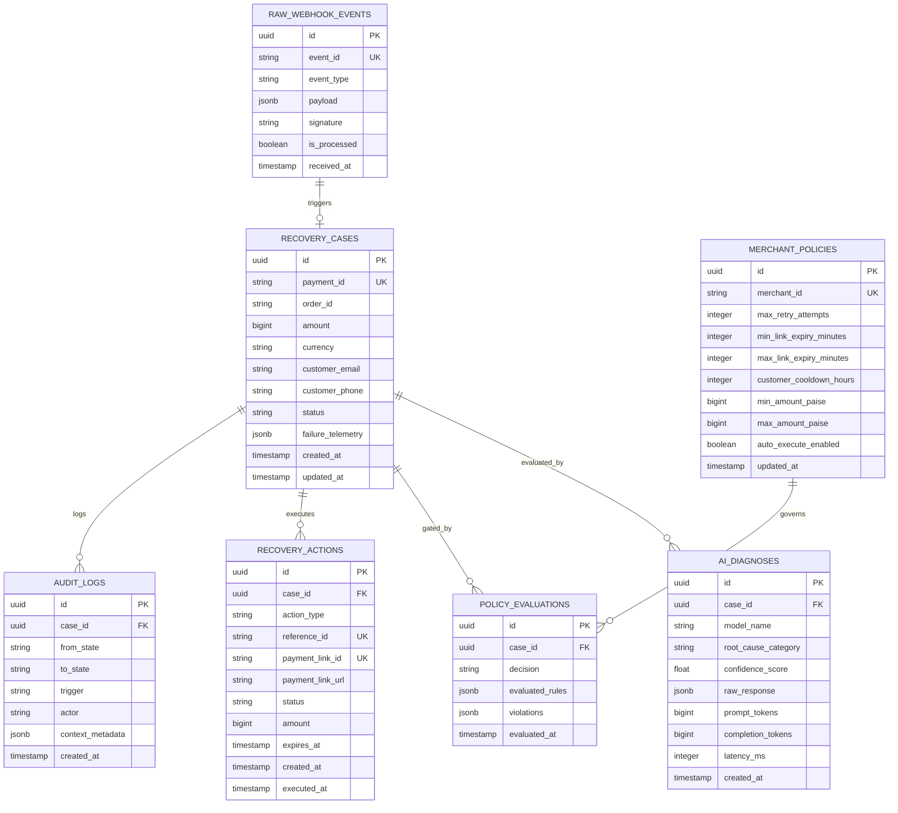

# Database Architecture & Schema Specification — Project Phoenix

## 1. Overview & Technology Selection

Project Phoenix utilizes **PostgreSQL 15+** as its primary system of record. PostgreSQL provides strong ACID guarantees, robust JSONB manipulation capabilities for telemetry payloads, and transactional isolation for high-integrity state machine transitions.

---

## 2. Entity-Relationship Diagram



---

## 3. SQL DDL Specifications

```sql
-- Extension for UUID generation
CREATE EXTENSION IF NOT EXISTS "uuid-ossp";

-- Table 1: Raw Webhook Ingestion & Deduplication
CREATE TABLE raw_webhook_events (
    id UUID PRIMARY KEY DEFAULT uuid_generate_v4(),
    event_id VARCHAR(128) NOT NULL UNIQUE,
    event_type VARCHAR(64) NOT NULL,
    entity_id VARCHAR(128) NOT NULL, -- e.g., payment_id or payment_link_id
    payload JSONB NOT NULL,
    signature VARCHAR(256) NOT NULL,
    is_processed BOOLEAN NOT NULL DEFAULT FALSE,
    received_at TIMESTAMPTZ NOT NULL DEFAULT NOW()
);

CREATE INDEX idx_raw_webhook_entity_id ON raw_webhook_events(entity_id);
CREATE INDEX idx_raw_webhook_event_type ON raw_webhook_events(event_type);

-- Table 2: Recovery Cases (Core State Machine)
CREATE TABLE recovery_cases (
    id UUID PRIMARY KEY DEFAULT uuid_generate_v4(),
    payment_id VARCHAR(128) NOT NULL UNIQUE,
    order_id VARCHAR(128),
    amount BIGINT NOT NULL, -- Amount in paise/cents (integer)
    currency VARCHAR(8) NOT NULL DEFAULT 'INR',
    customer_email VARCHAR(255),
    customer_phone VARCHAR(32),
    status VARCHAR(32) NOT NULL DEFAULT 'DETECTED',
    failure_code VARCHAR(64),
    failure_reason VARCHAR(128),
    failure_telemetry JSONB NOT NULL DEFAULT '{}'::jsonb,
    is_recovered BOOLEAN NOT NULL DEFAULT FALSE,
    recovered_amount BIGINT DEFAULT 0,
    created_at TIMESTAMPTZ NOT NULL DEFAULT NOW(),
    updated_at TIMESTAMPTZ NOT NULL DEFAULT NOW()
);

CREATE INDEX idx_recovery_cases_status ON recovery_cases(status);
CREATE INDEX idx_recovery_cases_order_id ON recovery_cases(order_id);
CREATE INDEX idx_recovery_cases_customer_email ON recovery_cases(customer_email);
CREATE INDEX idx_recovery_cases_created_at ON recovery_cases(created_at DESC);

-- Table 3: AI Diagnostic Output
CREATE TABLE ai_diagnoses (
    id UUID PRIMARY KEY DEFAULT uuid_generate_v4(),
    case_id UUID NOT NULL REFERENCES recovery_cases(id) ON DELETE CASCADE,
    model_name VARCHAR(64) NOT NULL,
    root_cause_category VARCHAR(64) NOT NULL,
    confidence_score NUMERIC(4, 3) NOT NULL,
    diagnostic_summary TEXT NOT NULL,
    recommended_action VARCHAR(64) NOT NULL,
    suggested_expiry_minutes INTEGER,
    suggested_customer_note TEXT,
    raw_response JSONB NOT NULL,
    prompt_tokens INTEGER,
    completion_tokens INTEGER,
    latency_ms INTEGER NOT NULL,
    created_at TIMESTAMPTZ NOT NULL DEFAULT NOW()
);

CREATE INDEX idx_ai_diagnoses_case_id ON ai_diagnoses(case_id);

-- Table 4: Policy Engine Evaluations
CREATE TABLE policy_evaluations (
    id UUID PRIMARY KEY DEFAULT uuid_generate_v4(),
    case_id UUID NOT NULL REFERENCES recovery_cases(id) ON DELETE CASCADE,
    decision VARCHAR(32) NOT NULL, -- 'PASSED', 'REJECTED', 'MANUAL_REVIEW'
    evaluated_rules JSONB NOT NULL DEFAULT '[]'::jsonb,
    violations JSONB NOT NULL DEFAULT '[]'::jsonb,
    evaluated_at TIMESTAMPTZ NOT NULL DEFAULT NOW()
);

CREATE INDEX idx_policy_eval_case_id ON policy_evaluations(case_id);

-- Table 5: Recovery Actions (e.g. Razorpay Payment Links)
CREATE TABLE recovery_actions (
    id UUID PRIMARY KEY DEFAULT uuid_generate_v4(),
    case_id UUID NOT NULL REFERENCES recovery_cases(id) ON DELETE CASCADE,
    action_type VARCHAR(64) NOT NULL DEFAULT 'CREATE_PAYMENT_LINK',
    reference_id VARCHAR(128) NOT NULL UNIQUE,
    payment_link_id VARCHAR(128) UNIQUE,
    payment_link_url VARCHAR(512),
    amount BIGINT NOT NULL,
    currency VARCHAR(8) NOT NULL DEFAULT 'INR',
    status VARCHAR(32) NOT NULL DEFAULT 'PENDING', -- 'PENDING', 'ISSUED', 'PAID', 'EXPIRED', 'CANCELLED'
    expires_at TIMESTAMPTZ NOT NULL,
    created_at TIMESTAMPTZ NOT NULL DEFAULT NOW(),
    executed_at TIMESTAMPTZ
);

CREATE INDEX idx_recovery_actions_case_id ON recovery_actions(case_id);
CREATE INDEX idx_recovery_actions_plink_id ON recovery_actions(payment_link_id);
CREATE INDEX idx_recovery_actions_ref_id ON recovery_actions(reference_id);

-- Table 6: Immutable Audit Logs
CREATE TABLE audit_logs (
    id UUID PRIMARY KEY DEFAULT uuid_generate_v4(),
    case_id UUID REFERENCES recovery_cases(id) ON DELETE SET NULL,
    from_state VARCHAR(32),
    to_state VARCHAR(32) NOT NULL,
    trigger VARCHAR(64) NOT NULL,
    actor VARCHAR(64) NOT NULL, -- e.g. 'SYSTEM_GATEWAY', 'AI_PLANNER', 'POLICY_ENGINE', 'OPERATOR'
    context_metadata JSONB NOT NULL DEFAULT '{}'::jsonb,
    created_at TIMESTAMPTZ NOT NULL DEFAULT NOW()
);

CREATE INDEX idx_audit_logs_case_id ON audit_logs(case_id);
CREATE INDEX idx_audit_logs_created_at ON audit_logs(created_at DESC);

-- Table 7: Merchant Policy Configuration
CREATE TABLE merchant_policies (
    id UUID PRIMARY KEY DEFAULT uuid_generate_v4(),
    merchant_id VARCHAR(64) NOT NULL UNIQUE DEFAULT 'default_merchant',
    max_retry_attempts INTEGER NOT NULL DEFAULT 2,
    min_link_expiry_minutes INTEGER NOT NULL DEFAULT 15,
    max_link_expiry_minutes INTEGER NOT NULL DEFAULT 1440,
    customer_cooldown_hours INTEGER NOT NULL DEFAULT 2,
    min_amount_paise BIGINT NOT NULL DEFAULT 10000, -- ₹100
    max_amount_paise BIGINT NOT NULL DEFAULT 50000000, -- ₹500,000
    auto_execute_enabled BOOLEAN NOT NULL DEFAULT TRUE,
    confidence_threshold NUMERIC(4, 3) NOT NULL DEFAULT 0.80,
    created_at TIMESTAMPTZ NOT NULL DEFAULT NOW(),
    updated_at TIMESTAMPTZ NOT NULL DEFAULT NOW()
);
```

---

## 4. Idempotency & Transactional Guarantees

1. **Webhook Deduplication:**
   When a webhook arrives, insertion into `raw_webhook_events` is executed with:
   ```sql
   INSERT INTO raw_webhook_events (event_id, event_type, entity_id, payload, signature)
   VALUES (:event_id, :event_type, :entity_id, :payload, :signature)
   ON CONFLICT (event_id) DO NOTHING;
   ```
   If zero rows are inserted, the gateway recognizes the replay and exits with HTTP 200 without reprocessing.

2. **Atomic State Updates:**
   Transitions in `recovery_cases` verify current state within a single transaction:
   ```sql
   UPDATE recovery_cases
   SET status = 'PLAN_GENERATED', updated_at = NOW()
   WHERE id = :case_id AND status = 'DIAGNOSING';
   ```
