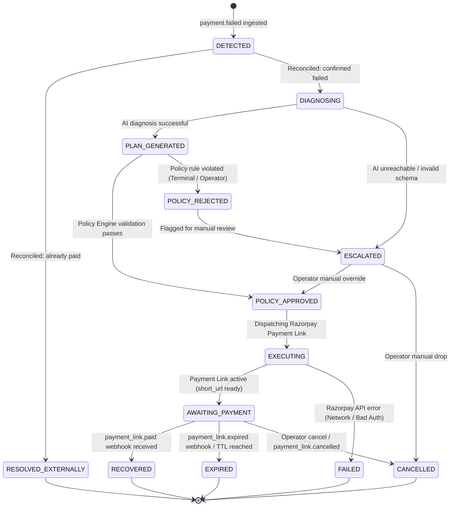

# State Machine & Case Lifecycle Specification — Project Phoenix

## 1. State Machine Overview

The `RecoveryCase` state machine enforces strict, deterministic lifecycle transitions for every failed payment handled by Project Phoenix. 

State transitions are **transactional, guarded, and audited**.

---

## 2. State Transition Diagram

---

## 3. State Definitions

| State | Type | Description |
| :--- | :--- | :--- |
| `DETECTED` | Initial | `payment.failed` event ingested and verified; awaiting authoritative Razorpay reconciliation. |
| `RESOLVED_EXTERNALLY` | Terminal (Non-Action) | Reconciliation found the customer already completed the payment via another attempt. No recovery action needed. |
| `DIAGNOSING` | Active | Context compiled and submitted to AI Recovery Planner for diagnosis and plan generation. |
| `PLAN_GENERATED` | Active | AI has returned a valid structured `RecoveryPlan` adhering to JSON schema. |
| `POLICY_APPROVED` | Active | Deterministic Policy Engine validated all business invariants; ready for execution. |
| `POLICY_REJECTED` | Paused | Plan violated merchant policies (e.g. max retries exceeded, cooldown violated). |
| `EXECUTING` | Transient | Razorpay client is calling `POST /v1/payment_links` with idempotency reference ID. |
| `AWAITING_PAYMENT` | Active Waiting | Payment link generated and active; waiting for customer payment or link expiry. |
| `RECOVERED` | **Terminal Success** | Customer completed payment on recovery link (`payment_link.paid`). Revenue successfully recovered. |
| `EXPIRED` | **Terminal Failure** | Payment link expired without payment; no further automated retries permitted. |
| `CANCELLED` | **Terminal Failure** | Case explicitly cancelled by human operator or system policy. |
| `FAILED` | **Terminal Error** | Unrecoverable technical failure during execution (e.g., persistent API network failure). |
| `ESCALATED` | Active Waiting (HITL) | Case paused requiring human operator review and manual decision. |

---

## 4. State Transition Matrix

| From State | Event / Trigger | Guard Condition | To State | Action / Side Effect |
| :--- | :--- | :--- | :--- | :--- |
| `[*] ` | `WEBHOOK_PAYMENT_FAILED` | Signature verified & unique event | `DETECTED` | Insert into `recovery_cases` & `audit_logs` |
| `DETECTED` | `RECONCILE_CHECK` | Payment status is `captured` or `authorized` | `RESOLVED_EXTERNALLY` | Log reconciliation bypass; halt pipeline |
| `DETECTED` | `RECONCILE_CHECK` | Payment status is `failed` | `DIAGNOSING` | Spawn context aggregation and AI task |
| `DIAGNOSING` | `AI_PLAN_SUCCESS` | Valid JSON matching `RecoveryPlan` | `PLAN_GENERATED` | Insert into `ai_diagnoses` |
| `DIAGNOSING` | `AI_PLAN_ERROR` | Timeout / JSON parse failure | `ESCALATED` | Flag case for human inspection |
| `PLAN_GENERATED`| `POLICY_CHECK` | All deterministic policy rules evaluate `TRUE` | `POLICY_APPROVED` | Record `policy_evaluations` |
| `PLAN_GENERATED`| `POLICY_CHECK` | Any mandatory policy rule evaluates `FALSE` | `POLICY_REJECTED` | Record violations; trigger notification |
| `POLICY_APPROVED`| `DISPATCH_EXECUTION` | Idempotency reference generated | `EXECUTING` | Invoke `razorpay_client.create_payment_link()` |
| `EXECUTING` | `API_CALL_SUCCESS` | Razorpay returned HTTP 200/201 with `plink_id` | `AWAITING_PAYMENT` | Save `recovery_actions` record |
| `EXECUTING` | `API_CALL_ERROR` | 4xx/5xx from Razorpay API | `FAILED` | Log error details in `audit_logs` |
| `AWAITING_PAYMENT`| `WEBHOOK_PAYMENT_LINK_PAID` | Signature verified & link ID matches | `RECOVERED` | Set `is_recovered = true`, update timestamps |
| `AWAITING_PAYMENT`| `WEBHOOK_PAYMENT_LINK_EXPIRED` | TTL reached | `EXPIRED` | Mark action as EXPIRED |
| `AWAITING_PAYMENT`| `OPERATOR_CANCEL` | Operator initiated | `CANCELLED` | Call `POST /v1/payment_links/{id}/cancel` |
| `POLICY_REJECTED`| `ESCALATE_TRIGGER` | Auto-escalate enabled | `ESCALATED` | Display on HITL queue in dashboard |
| `ESCALATED` | `OPERATOR_OVERRIDE` | Operator clicked "Approve" | `POLICY_APPROVED` | Proceed to execution with operator notes |
| `ESCALATED` | `OPERATOR_DROP` | Operator clicked "Dismiss" | `CANCELLED` | Close case |

---

## 5. Out-of-Order Webhook Handling & Idempotency Rules

### 5.1 Case A: `payment_link.paid` arrives before state update to `AWAITING_PAYMENT`
- **Scenario:** High network latency on internal DB update while webhook callback is instantaneous.
- **Resolution:** If `payment_link.paid` matches a case currently in `EXECUTING` or `POLICY_APPROVED`, the state machine immediately transitions the case directly to `RECOVERED`.

### 5.2 Case B: `order.paid` or `payment.captured` arrives after `payment.failed`
- **Scenario:** Customer opened a second tab and completed checkout before Phoenix generated a link.
- **Resolution:** If the case is in `DETECTED`, `DIAGNOSING`, or `PLAN_GENERATED`, the case transitions to `RESOLVED_EXTERNALLY`. If a link was already issued (`AWAITING_PAYMENT`), Phoenix calls Razorpay to cancel the outstanding payment link (`POST /v1/payment_links/{id}/cancel`) and transitions the case to `RESOLVED_EXTERNALLY`.

### 5.3 Protected Terminal States & Out-of-Order Webhooks
- **Terminal State Protection:** Once a case enters `RECOVERED`, it is an immutable terminal success state. A late arriving `payment_link.expired` or `payment_link.cancelled` MUST NOT mutate `RECOVERED`.
- **Payment Verification:** `payment_link.paid` triggers recovery only when the underlying payment entity has `status == 'captured'` (`authorized != recovered`).
- **Partial Payments:** `payment_link.partially_paid` is audited but does NOT mark case `RECOVERED` as `accept_partial = false` is standard policy.

---

## 6. Terminal State Invariants

Once a case enters any terminal state (`RECOVERED`, `EXPIRED`, `CANCELLED`, `RESOLVED_EXTERNALLY`):
1. **No automated workflow may mutate the status.**
2. No further payment links may be issued for that payment event.
3. Every subsequent event received referencing that payment will be logged as an audit note only.
